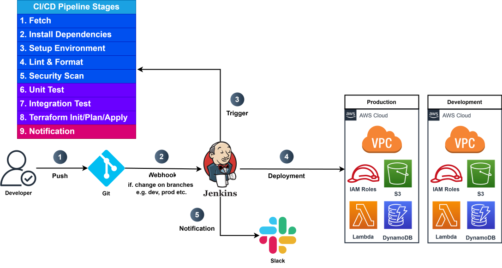

# AWS Lambda DevOps Framework

A comprehensive DevOps framework for AWS Lambda functions, focusing on maintainability, scalability, and reliability. Includes shared layers, CI/CD pipeline integration, testing infrastructure, and deployment automation.

## Table of Contents
1. [Architecture](#architecture)
2. [Project Structure](#project-structure)
3. [Getting Started](#getting-started)
4. [Development](#development)
5. [Testing](#testing)
6. [CI/CD Pipeline](#cicd-pipeline)
7. [Function-Driven Deployment](#function-driven-deployment)
8. [Documentation](#documentation)

## Architecture



The framework follows a structured approach:
- **Shared Layer**: Common utilities and dependencies
- **Service-based Organization**: Functions organized by domain
- **CI/CD Pipeline**: Automated testing and deployment
- **Testing Framework**: Unit and integration tests
- **Infrastructure as Code**: Terraform-based deployment
- **Function-Driven Deployment**: Configuration-based infrastructure

## Project Structure

```
/
├── lambda/                    # Lambda functions
│   ├── shared_layer/          # Common utilities
│   └── [service]/             # Service-specific functions
│       └── [function]/        # Function directory
│           ├── index.py       # Function code
│           ├── function.json  # Function configuration
│           └── requirements.txt # Dependencies
├── tests/                     # Test suite
│   ├── unit/                  # Unit tests
│   └── integration/           # Integration tests
├── terraform/                 # Infrastructure as Code
│   ├── environments/          # Environment configs
│   └── modules/               # Reusable modules
├── scripts/                   # Utility scripts
├── docs/                      # Documentation
└── Jenkinsfile                # CI/CD pipeline
```

## Getting Started

### Prerequisites
- AWS CLI configured
- Python 3.11+
- Jenkins server
- Git

### Setup
```bash
# Clone repository
git clone <repository-url>
cd <repository-name>

# Create virtual environment
python -m venv venv
source venv/bin/activate  # On Windows: venv\Scripts\activate

# Install dependencies
pip install -r requirements-dev.txt

# Run tests
pytest tests/unit
```

## Development

### Creating a New Lambda Function
```bash
# Create function structure
mkdir -p lambda/<service>/<function>
touch lambda/<service>/<function>/index.py
touch lambda/<service>/<function>/function.json
touch lambda/<service>/<function>/requirements.txt

# Create tests
mkdir -p tests/unit/<service>
touch tests/unit/<service>/test_<function>.py
mkdir -p tests/integration/<service>
touch tests/integration/<service>/test_<function>_integration.py
```

### Function Configuration
Each function requires a `function.json` configuration file:

```json
{
  "name": "function_name",
  "description": "Function description",
  "runtime": "python3.11",
  "handler": "index.lambda_handler",
  "api": {
    "path": "/endpoint",
    "methods": ["GET"]
  }
}
```

### Code Quality
- **flake8**: Code linting
- **black**: Code formatting
- **isort**: Import sorting

```bash
# Run linting
./scripts/lint.sh

# Format code
./scripts/format.sh
```

## Testing

### Unit Tests
```bash
# Run all unit tests
./scripts/run_unit_tests.sh

# Run specific tests
./scripts/run_unit_tests.sh tests/unit/device/test_device_status.py
```

### Integration Tests
```bash
# Run all integration tests (dev)
./scripts/run_integration_tests.sh

# Run against staging
./scripts/run_integration_tests.sh staging
```

### Mock AWS Services
```bash
# Mock all services
./scripts/run_mock_tests.sh

# Mock specific services
./scripts/run_mock_tests.sh staging dynamodb
```

## CI/CD Pipeline

### Pipeline Stages
1. Checkout
2. Setup Environment
3. Lint & Format
4. Unit Tests
5. Build Shared Layer
6. Build Lambda Functions
7. Integration Tests
8. Infrastructure Deployment
9. Lambda Deployment

### Pipeline Parameters
- `ENVIRONMENT`: Target environment (dev/staging/prod)
- `FUNCTION_NAME`: Specific function or "all"
- `SKIP_TESTS`: Skip all tests
- `SKIP_INTEGRATION_TESTS`: Skip integration tests
- `DEPLOY_INFRASTRUCTURE`: Deploy infrastructure changes

## Function-Driven Deployment

The framework uses a function-driven deployment pattern where function configurations drive infrastructure deployment:

1. **Function Configuration**: Define function properties in `function.json`
2. **Infrastructure as Code**: Terraform reads configurations to provision resources
3. **Environment-Specific**: Override configurations per environment
4. **Automated Deployment**: CI/CD pipeline handles deployment

For detailed information, see the [Function-Driven Deployment Guide](docs/function_driven_deployment.md).

## Documentation

### Core Documentation
- [DevOps Setup Guide](docs/DEVOPS_SETUP.md): Infrastructure and deployment
- [Testing Guide](docs/testing_guide.md): Testing framework and practices
- [Function-Driven Deployment Guide](docs/function_driven_deployment.md): Configuration-based deployment

### Additional Resources
- [Architecture Documentation](docs/architecture/): System design and components
- [API Documentation](docs/api/): Function specifications and examples